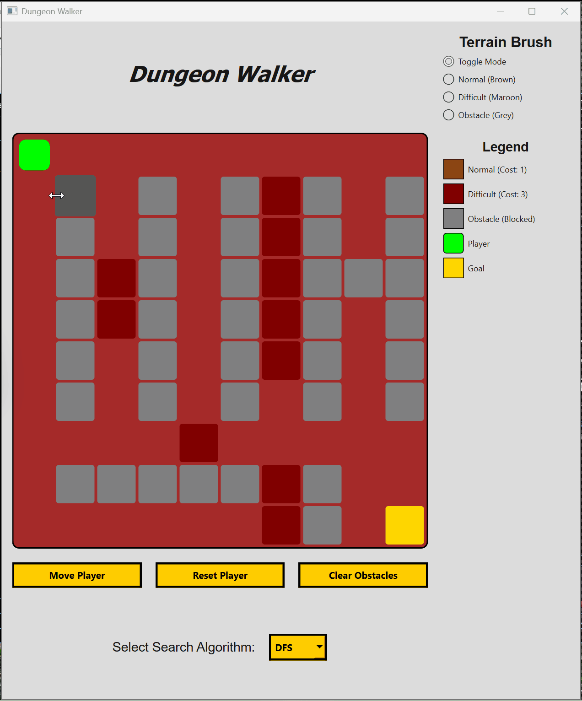

# Dungeon Walker

Dungeon Walker is a Python/PyQt6 pathfinding visualizer that demonstrates object-oriented programming, MVC architecture, graph search algorithms, and event-driven GUI programming.

The project allows users to create obstacles on a grid, select a pathfinding algorithm, and visualize a player moving through the dungeon.

## Features

- Interactive 10×10 dungeon grid
- Click cells to create and remove obstacles
- Animated player movement
- Pathfinding algorithm selection
- Reset player position
- Clear obstacles
- Object-oriented design
- MVC-style separation of concerns

## Pathfinding Algorithms

The project is designed to support several graph-search algorithms:

- Breadth-First Search (BFS)
- Depth-First Search (DFS)
- Dijkstra's Algorithm
- A* Search

## In Practice

Upon starting the program you are met with the player at the top left of the grid, and the goal space at the bottom right.

This demo showcases the core functionality of Dungeon Walker, including interactive obstacle creation, pathfinding algorithm selection, and animated movement through the generated dungeon.

